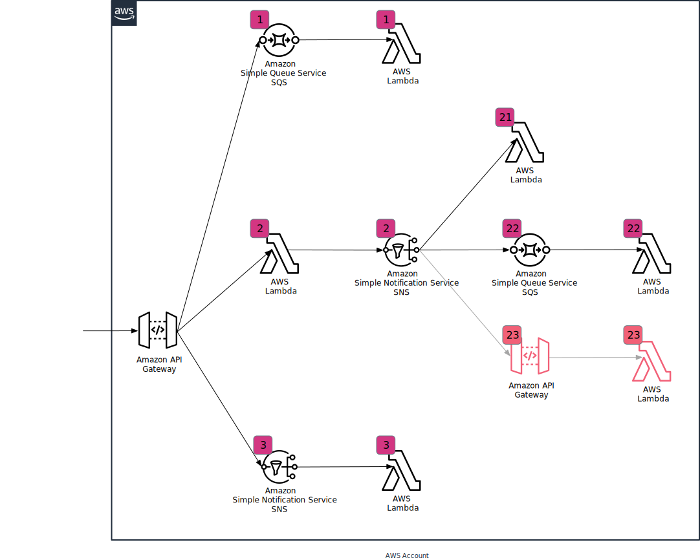

# Honeycomb trace propagation tests

This is a *very* **very** ugly repo, with *very* **very** ugly code, and *very* **very** ugly practices.

This was built to help me test [trace context propagation in Honeycomb's Python Beeline](https://github.com/honeycombio/beeline-python/pull/77).

I promised I would clean it up and open-source it, but of course no time for cleanup existed. Sooo I am posting it like this in hopes it at last helps someone.

Next time I end up playing with trace propagation I'll likely come back and clean this up.

## Arch

This is a diagram of what the thing will create:

> Note the light red part does not work. And that the test app is a Python app, not React.

## Working on this

I **highly** recommend against it. If you do insist though, you'll likely want to change the version of `honeycomb-beeline` in `Pipfile`. And other ugly stuff that may or may not contain the cool replacement string `xxx`.
